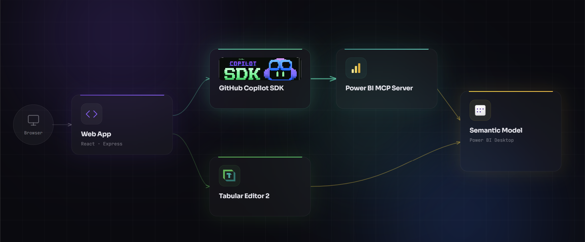

# Power BI Best Practices Analyzer & AI Auto-Fix

> **GitHub Copilot SDK Challenge Submission**

A [community workflow](https://community.fabric.microsoft.com/t5/Power-BI-Community-Blog/Automate-Power-BI-Model-Optimization-Best-Practice-Analyzer/ba-p/5000187) showed that Tabular Editor BPA + AI fixes via MCP is a powerful combination. This project takes it further with the **GitHub Copilot SDK** — embedding the full analyze-fix-verify loop into one web app with programmatic approval gates, real-time agent streaming, and a persistent audit trail.

**Analyze** 71 BPA rules. **Fix** with a Copilot SDK agent that requires your approval for every write. **Verify** in one click.



> [Demo Video](https://youtu.be/xYDh9zKUyOI) 

## Quick Start

```bash
# Backend
cd backend && npm install && cp .env.example .env
npx prisma migrate dev && npm run dev    # → http://localhost:3001

# Frontend (new terminal)
cd frontend && npm install && npm run dev # → http://localhost:5173
```

Edit `backend/.env` with your paths:

```env
DATABASE_URL="file:./prisma/dev.db"
PBI_MCP_COMMAND=C:\path\to\powerbi-modeling-mcp.exe
PBI_MCP_ARGS=--start
TABULAR_EDITOR_PATH=..\TabularEditor.2.27.2\TabularEditor.exe
```

**Requires:** Node 18+, Power BI Desktop (model open), GitHub Copilot auth, [Power BI Modeling MCP Server](https://marketplace.visualstudio.com/items?itemName=analysis-services.powerbi-modeling-mcp)

## [Full Documentation](./docs/README.md)

Architecture, Copilot SDK integration, deployment, testing, and RAI notes.

## License

[MIT](LICENSE)
