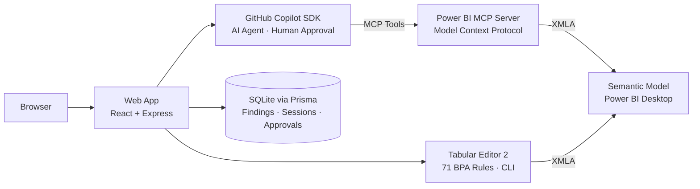

# Power BI BPA & AI Auto-Fix - Documentation

## The Story

A Power BI developer has a semantic model with 200+ objects. They know it has issues - non-optimized DAX, missing format strings, inconsistent naming. A [great community workflow](https://community.fabric.microsoft.com/t5/Power-BI-Community-Blog/Automate-Power-BI-Model-Optimization-Best-Practice-Analyzer/ba-p/5000187) showed how to combine Tabular Editor's Best Practice Analyzer with AI-assisted fixes via MCP.

This project takes that idea further. Now that the **GitHub Copilot SDK** is available, we can collapse the workflow into a single web app: analyze with all [71 BPA rules](https://github.com/microsoft/Analysis-Services/blob/master/BestPracticeRules/BPARules.json), fix violations with an AI agent that requires your approval for every write, and verify, all without leaving the window.

---

## How It Works

1. **Connect**: The app auto-discovers running Power BI Desktop instances via the MCP server
2. **Analyze**: Tabular Editor 2 CLI evaluates all 71 BPA rules. Findings appear in a filterable dashboard grouped by severity and category
3. **Fix** - Two paths:
   - *Deterministic*: Rules with a known fix expression run instantly via TE2 csharp scripts
   - *AI-powered*: The Copilot SDK agent inspects the model, reasons about the violation, and proposes a fix. Every write surfaces an approval card in the UI - you approve or reject before anything changes
4. **Verify**: Rerun analysis. A comparison view shows resolved, new, and recurring findings
5. **Query**: A built-in DAX workspace with Monaco editor, plus natural-language-to-DAX generation via a separate Copilot SDK session

---

## Architecture



The **React frontend** talks to an **Express backend** that orchestrates three systems: **Tabular Editor 2 CLI** for rule evaluation, the **GitHub Copilot SDK** for AI agent sessions, and the **Power BI Modeling MCP Server** for model read/write. Everything is persisted in **SQLite via Prisma** - findings, sessions, tool calls, approvals.

> Full diagram: [architecture-diagram.png](../assets/architecture-diagram.png) · [interactive version](../assets/architecture-diagram.html)

---

## Copilot SDK Integration

Two usage patterns:

**Agentic fix sessions** - `CopilotClient.createSession()` with `defineTool()`-wrapped MCP tools. The agent streams reasoning, tool calls, and message deltas via SSE. Write operations block on a Promise until the user approves in the UI. Sessions can be resumed via `resumeSession()`.

**DAX generation** - A separate `CopilotClient` session with the MCP server config passed directly. The agent inspects the model schema and generates valid DAX from natural language.

Key APIs: `CopilotClient`, `createSession`, `resumeSession`, `sendAndWait`, `defineTool`, `SessionEvent`

---

## Setup

### Prerequisites

- Node.js 18+
- Power BI Desktop with a semantic model open
- GitHub Copilot authenticated (copilot --version)
- Power BI Modeling MCP Server (VS Code extension or standalone exe)
- Tabular Editor 2 (bundled in TabularEditor.2.27.2/, or provide your own path)

### Install

```bash
git clone <repo-url> && cd copilot-sdk-challenge

# Backend
cd backend && npm install && cp .env.example .env
npx prisma migrate dev && npm run dev    # → http://localhost:3001

# Frontend (new terminal)
cd frontend && npm install && npm run dev # → http://localhost:5173
```

### Environment (`backend/.env`)

```env
DATABASE_URL="file:./prisma/dev.db"
PORT=3001
PBI_MCP_COMMAND=C:\path\to\powerbi-modeling-mcp.exe
PBI_MCP_ARGS=--start
TABULAR_EDITOR_PATH=..\TabularEditor.2.27.2\TabularEditor.exe
TABULAR_EDITOR_TIMEOUT=120000
```

---

## Testing

```bash
cd backend && npm test                    # Vitest unit tests
cd frontend && npm test                   # Vitest unit tests
cd frontend && npm run test:e2e           # Playwright (mock API)
cd frontend && npm run test:e2e:live      # Playwright (live backend + PBI Desktop)
```

---

## Deployment

**Dev**: Backend + frontend run as separate dev servers with local SQLite.

**Production build**: `cd frontend && npm run build` + `cd backend && npm run build`

---

## Potential Enhancements 

It would be more user friendly to ship this as a electron app. However, i started with a simple web app because it was easier to test the ui with playwright.

---

## Responsible AI

**Approval gates** - Every write operation is classified programmatically and gated behind a Promise-based approval flow. The AI agent cannot modify the model without explicit user consent in the UI.

**Transparency** - Every session is fully inspectable: reasoning steps, tool calls with parameters, approval decisions. All persisted in the database.

**Data privacy** - Model analysis runs locally via Tabular Editor CLI. AI interactions go through GitHub Copilot's enterprise infrastructure. No model data is exported.
